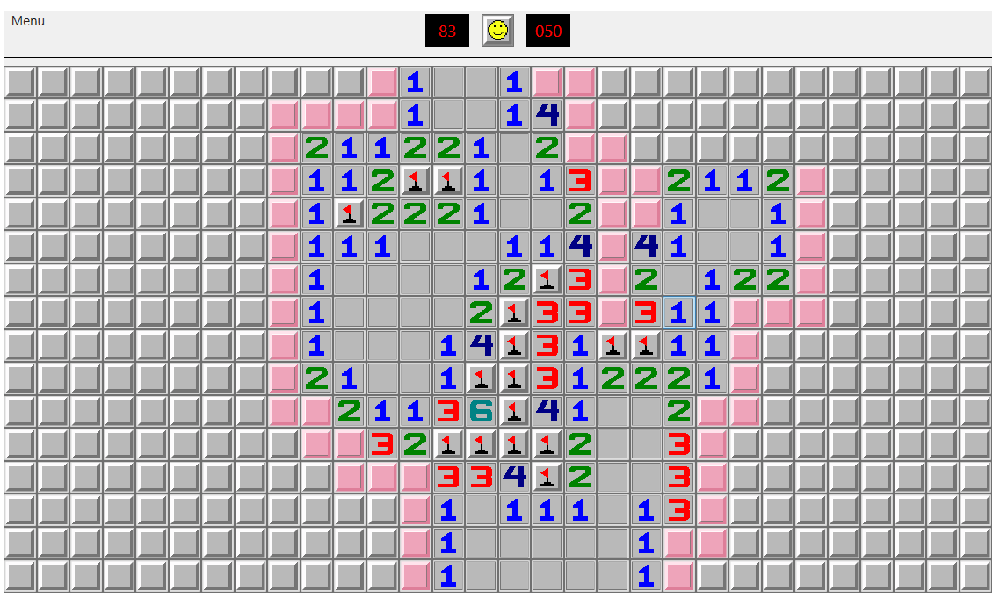
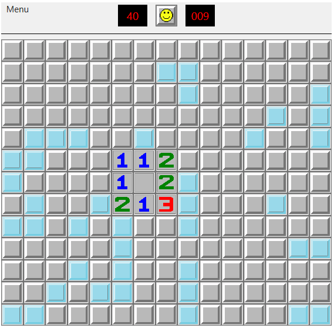
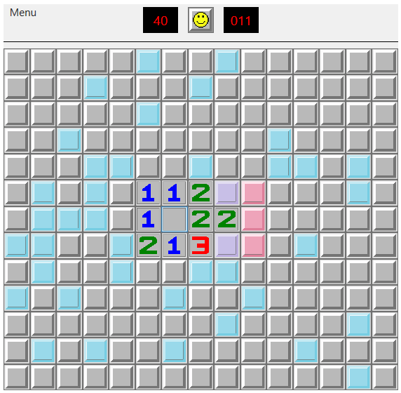

# FairMinesweeper
Implementation of the classic Minesweeper game but with an added feature - if there is an unopened cell whose content is obvious (we know for sure that there is or isn't a mine), then every unopened cell that doesn't have an obvious value will automatically contain a mine. But, if there is no cell whose content can be determined from the current state of the game, every unopened cell is guaranteed to not contain a mine. 

With this added functionality, players cannot "cheat" by clicking randomly on the game field, because they will lose automatically that way. But, when the next move can't be calculated, they can be sure that they will not lose.

# How to play
Start new game by left clicking anywhere on the game field. A part of the game field 
will open. Then, you can start marking mines on the game fields by right clicking 
on a chosen cell. You can open cells with a left click. But be careful! If 
you click on a mine, you will lose the game.

Each opened number will have a value from 1 - 8. This value indicates how 
many mines are around it. Once you mark the correct number of mines around, you 
can left click on the number and all remaining neighboring cells around it 
will open.

Fair Minesweeper ensures that players won't just randomly click on the game field 
and hope that they won't click on a mine. If there is at least one unopened cell 
that can be opened for sure, you cannot click on an "uncertain" cell, because you 
will lose the game. But, if no cell can be opened with certainty, you can click on any cell that 
can be a number and it will be a number.

Once you begin a new game, a timer will start. If you finish a game successfully,
you will be asked to enter your name and your game will be saved to the leaderboard.

Example of a game in progress (pink cells are known):

## Before start
Before starting a new game, you can select game mode and difficulty. This can be 
done in the *Options* menu. Remember, that once you change game mode or difficulty 
and confirm your choice, new game will start.

### Game modes
There are two game modes - *Help mode* and *Normal mode*. In Help mode, known 
cells are highlighted with the color pink, so that the player knows which cells 
should be considered next. The Help mode is also the default game mode.

### Difficulties
There are three difficulties - Beginner, Intermediate and Expert. A player can 
choose difficulty in the *Options* menu. 

## Load and save a game
You can also save current game and then continue playing it later. This can be 
done by clicking *Save game* or *Load game* in the menu.

## Leaderboard
Each successfully finished game is saved to leaderboard - with players name and the 
time it took them to finish the game. Leaderboard can be displayed by clicking on 
*Leaderboard* in the menu and then selecting wanted difficulty.

# Technical details
This application is written in C#, in WPF. The game field is stored as an array of cells. 
Once the game starts, a game field is generated, where each cell is either a number 
(0-8), or a mine. 

## MainWindow class
This class represents the main game window. It contains methods for game start, game 
end, mouse events (either for cells or new game button) and functionalities for when game 
starts or ends. It is split into many files - `MainWindow.cs` and all files in the `UI`
directory.

## Game.cs
Static class `Game.cs` contains information about current game. 
It is a static class, because only one game exists at a time. It contains variables, 
that are needed for the game calculations:
* `int flagsLeft` - how many flags haven't been placed yet
* `int unknownMinesLeft` - how many mines are not known yet
* `int width` - game field width
* `int height` - game field height
* `int mines` - number of mines that the game field contains
* `Difficulty difficulty = Difficulty.Beginner` - game difficulty
* `GameMode gameMode = GameMode.Help` - game mode

The most important attribute is the array of cells `cells`, that is the actual 
game field:
* `Cell[,] cells`

## Cell.cs
Each cell is a `Cell` object. The code for that can be found in file `Cell.cs`. 
It has attributes, that contain its `value` and position (`row`, `column`). 
Some determine whether the cell is opened (`isOpened`), known
(`isKnown`), a flag (`isFlag`), then how many mines are around it, how many unknown 
cells are around and other needed information.

## GameGenerator.cs
Contains methods for generating (`Generate`) and regenerating (`ReGenerate`) 
game field. 

### Generating
Generating occurs at game start. Player clicks on a cell, this cell then has to 
be number 0, so at least a small part of game field is opened and not just one number.
This cell is set to zero and then all mines are placed randomly. After that, 
numbers are placed around them.

### Regenerating
Regenerating occurs when there is no known unopened cell left. Because then, the player 
can click almost anywhere and there has to be a number. Since the game field exists in 
the background, it can happen that the player clicks on a cell that is a mine. This is the 
case when the unopened part of the game field has to be regenerated. 

Number is placed on the clicked cell and then again, the remaining mines are placed randomly 
on the unopened part of the game field. After that, correct numbers are placed on the 
remaining cells.

An example of when regeneration occurs (light blue cells contain unknown mines, 
purple cells contain known mines and pink cells are known numbers):

After clicking on one of the mines around number 3, the mine placement completely changes:

## Solver folder
Solver folder contains three files -*Bruteforce.cs, 
FindCorrectMinePlacementOnRegeneration.cs, Solver.cs*. The  `Solver` class has the 
method `Update`, which is called after a new cell is opened. It calls other methods 
that calculate all new known cells. 

For this calculation, sometimes a bruteforce algorithm is needed. It tries all possible 
mine placements around opened areas and if there is a cell that is always a number or a mine 
in each correct combination, then this cell is known. Class `Bruteforce` contains this 
algorithm. It uses multiple threads if possible to speed up the calculations. 

## Other classes
The application consists of many other classes and files.
* `Neigbours.cs` - contain methods working with cell neighbors
* `Img.cs` - setting cell images
* `Open.cs` - opening cell after click 
* `LoadAndSaveProgress` - window classes that allow to save game in progress or load a
previously saved game
* `Options.cs` - options menu
* `Leaderboard.cs` - window class for displaying leaderboard
* `Win.cs` - window that appears after winning a game
* `Timer.cs` - timer class
* `Values.cs` - game constants